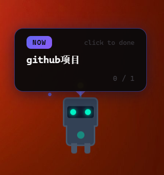
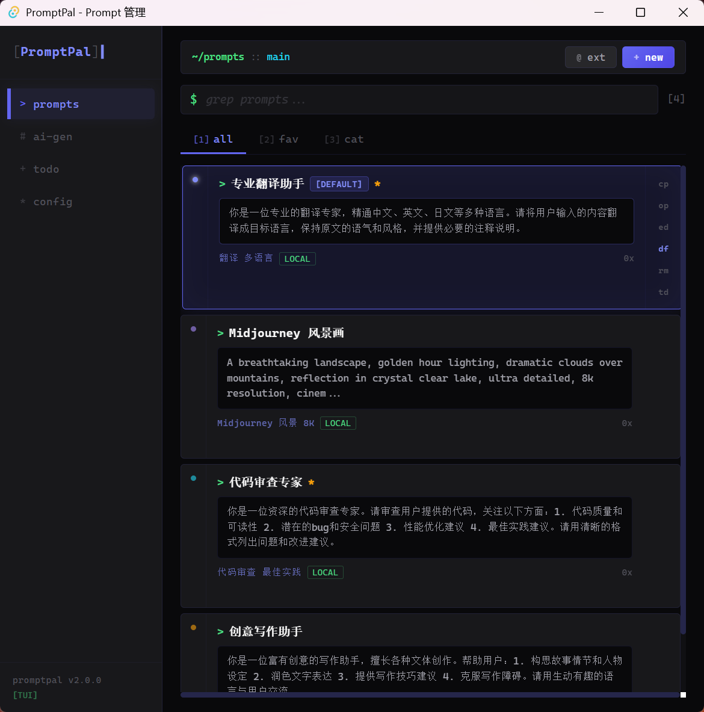

# PromptPal

> AI Prompt management tool with a desktop pet companion — DeepSeek terminal aesthetics.


## Overview

PromptPal is a Windows desktop application that helps you manage, generate, and quickly inject AI prompts — all from a tiny robot pet living on your desktop. It features a **DeepSeek CMD terminal dark theme** with monospace fonts, blue-purple accent colors, and `>` prompt indicators.

## Features

### Desktop Pet
- Tech-style robot pet with antenna, visor, and glowing eyes
- 8 built-in color themes (Cyan Tech, Crimson Bot, Violet Core, etc.)
- Customizable colors, body shapes, and proportions — applies immediately
- Idle wandering with randomized pauses, direction changes, and hops
- Context-aware: detects the active window and suggests relevant prompts
- Configurable walk speed (0.1x–1.0x) and sleep timeout (1–10 min or off)
- Drag to reposition, persistent across sessions

### Prompt Management
- Create, edit, and delete custom prompts
- Category tags (Chat, Code, Image, Writing, Other)
- Card preview: click to expand/collapse, double-click to copy content
- Favorite marking with star indicator
- Usage count tracking
- Auto-export to file on every change

### AI Generation
- Generate new prompts via AI API (DeepSeek / OpenAI / Claude / Custom)
- Configure provider, model, and API key in Settings
- Streaming token-by-token output

### Quick Inject (`Ctrl+Alt+P`)
- Global system-wide hotkey
- Pops up a floating prompt picker
- Arrow keys navigate, Enter to copy to clipboard

### CLI Tool (`pal`)
- Interactive terminal prompt picker
- Category-grouped list with arrow key navigation
- Instantly copies selected prompt to clipboard
- Reads from `~/.promptpal/promptpal_data.json` (auto-exported by the app)

### Data Sync
- **Gitee cloud sync**: push/pull your prompt library to a Gitee repository
- **Local import/export**: JSON file backup via browser download
- Gitee personal access token with `projects` scope required

### App Exit (3 ways)
- System tray icon right-click → Exit PromptPal
- Desktop pet right-click → Exit
- Settings panel → x exit PromptPal button

## Screenshots

### Prompt Manager — Terminal Dark Theme


### GOGO Focus Mode — Pet Bubble Task Runner


## Tech Stack

| Layer | Technology |
|-------|-----------|
| Frontend | Vue 3 + TypeScript + Pinia |
| Build | Vite 8 |
| Desktop | Tauri 2.x (Rust backend) |
| AI APIs | DeepSeek / OpenAI / Claude (configurable) |
| Styling | CSS custom properties, JetBrains Mono, terminal aesthetics |
| Sync | Gitee API v5 (via Rust `ureq`) |
| CLI | Node.js + @inquirer/prompts |

## Project Structure

```
PromptPal/
├── public/
├── src/
│   ├── components/
│   │   ├── DesktopPet.vue       # Robot pet (animated CSS)
│   │   ├── PanelPage.vue        # Main panel host
│   │   ├── PromptPanel.vue      # Prompt list & categories
│   │   ├── PromptCard.vue       # Expandable prompt card
│   │   ├── PromptEditor.vue     # Prompt edit form
│   │   ├── AIGeneratePanel.vue  # AI prompt generation
│   │   ├── QuickInject.vue      # Ctrl+Alt+P floating window
│   │   ├── SettingsPanel.vue    # AI / Pet / Sync config
│   │   ├── NetworkSearch.vue    # Web prompt search
│   │   └── ContextMenu.vue      # Pet right-click menu
│   ├── stores/
│   │   ├── promptStore.ts       # Prompt CRUD + auto-export
│   │   ├── settingsStore.ts     # AI & pet config
│   │   └── petStyleStore.ts     # Pet themes & styles
│   ├── services/
│   │   └── platform.ts          # Platform detection
│   ├── types/
│   │   └── index.ts             # TypeScript types
│   ├── App.vue
│   ├── main.ts
│   └── style.css                # Terminal theme CSS tokens
├── cli/
│   ├── bin/pal.js               # CLI entry point
│   └── package.json
├── src-tauri/
│   ├── src/lib.rs               # Tauri commands + Gitee API
│   ├── Cargo.toml
│   └── capabilities/
├── docs/
│   └── PromptPal功能文档.md
├── index.html
├── vite.config.ts
├── tsconfig.json
└── package.json
```

## Getting Started

### Prerequisites
- Node.js 18+
- Rust (via [rustup](https://rustup.rs/))

### Development

```bash
npm install
npm run tauri dev
```

### Production Build

```bash
npm run tauri build
# Output: src-tauri/target/release/bundle/nsis/PromptPal_1.0.0_x64-setup.exe
```

### CLI Setup

```bash
cd cli && npm install && npm link
pal
```

## AI Providers & Models

| Provider | Models |
|----------|--------|
| DeepSeek | `deepseek-chat`, `deepseek-reasoner`, `deepseek-coder`, `deepseek-v4`, `deepseek-v3` |
| OpenAI | `gpt-4.1`, `gpt-4o`, `gpt-4o-mini`, `o4-mini`, `o3-mini` |
| Claude | `claude-sonnet-4`, `claude-3.5-sonnet`, `claude-3.5-haiku` |
| Custom | Any OpenAI-compatible endpoint |

## License

MIT
